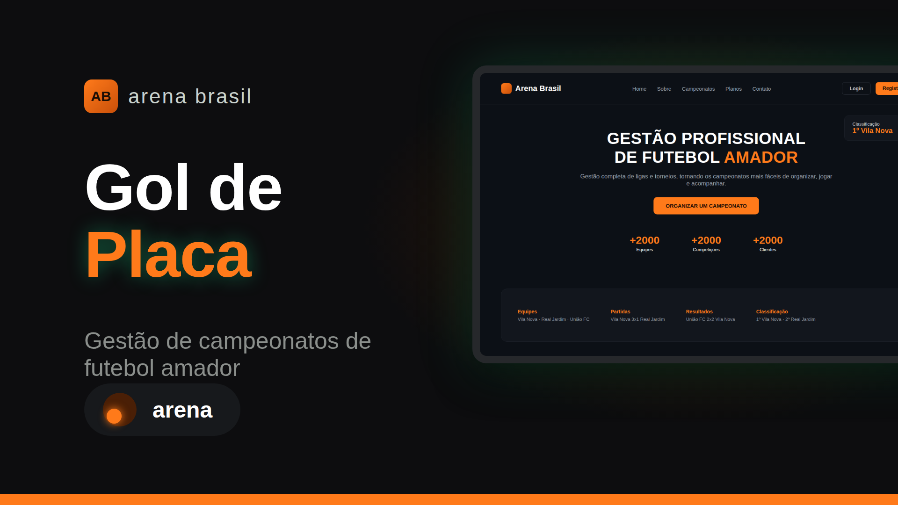

<h1 align="center">Arena Brasil</h1>

  Plataforma para organizar campeonatos de futebol amador: equipes, partidas, resultados e classificação em um só lugar.

  <a href="#-tecnologias">Tecnologias</a> &nbsp;|&nbsp;
  <a href="#-projeto">Projeto</a> &nbsp;|&nbsp;
  <a href="#-layout">Layout</a> &nbsp;|&nbsp;
  <a href="#-autor">Autor</a> &nbsp;|&nbsp;
  <a href="#memo-licença">Licença</a>

  

 

  

## 🚀 Tecnologias

Esse projeto foi desenvolvido com as seguintes tecnologias:

- HTML e CSS
- JavaScript
- Git e GitHub
- GitHub Pages

## 💻 Projeto

A Arena Brasil (projeto Gol de Placa) é uma plataforma de gestão profissional de futebol amador. Em vez de espalhar informações entre planilhas, mensagens e anotações, o organizador acompanha toda a competição em um só lugar: da montagem das equipes até a divulgação dos resultados.

**Como funciona**

- **Prepare a competição:** cadastre equipes e atletas com as informações organizadas.
- **Organize os jogos:** monte partidas e rodadas para dar ritmo ao campeonato.
- **Acompanhe cada resultado:** consulte placares e classificação durante a disputa.

A página conta ainda com um simulador de gestão, que mostra o passo a passo do sistema (equipes, partidas, resultados e classificação), e planos pensados para diferentes tamanhos de competição.

- [Visite o projeto online](https://deiversonsousa.github.io/arena-manager/)

## 🎨 Layout

O layout é dividido nas seções Home, Sobre, Campeonatos (simulador de gestão) e Planos, com destaque para os números da plataforma (+2000 equipes, +2000 competições, +2000 clientes) e um mockup da tela de gestão do campeonato.

## 👨‍💻 Autor

**Deiverson Sousa**, desenvolvedor fullstack.

- [GitHub](https://github.com/deiversonsousa)
- [LinkedIn](https://linkedin.com/in/sousadeiverson)
- [Instagram](https://instagram.com/deiversonnsousa)

## :memo: Licença

Esse projeto está sob a licença MIT.

---

Feito com 💚 por Deiverson Sousa

